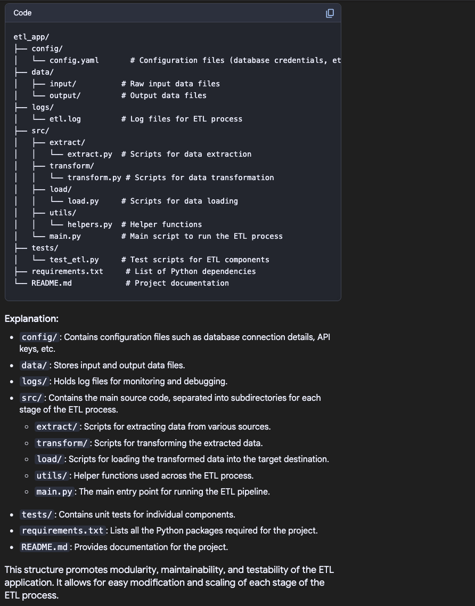

POSTGRES Usage
Configuration files:

---
installed on Mac ARM architecture using brew
all files are located in /opt/homebrew/var/postgres/
used jsonb to store data transferred from ivolunteer

---

installed on Linux

---
ToDo:
Error handling: add error handling to your code to gracefully handle potential issues 
-database connection errors 
-weserver errors
-app errors

---

ß
