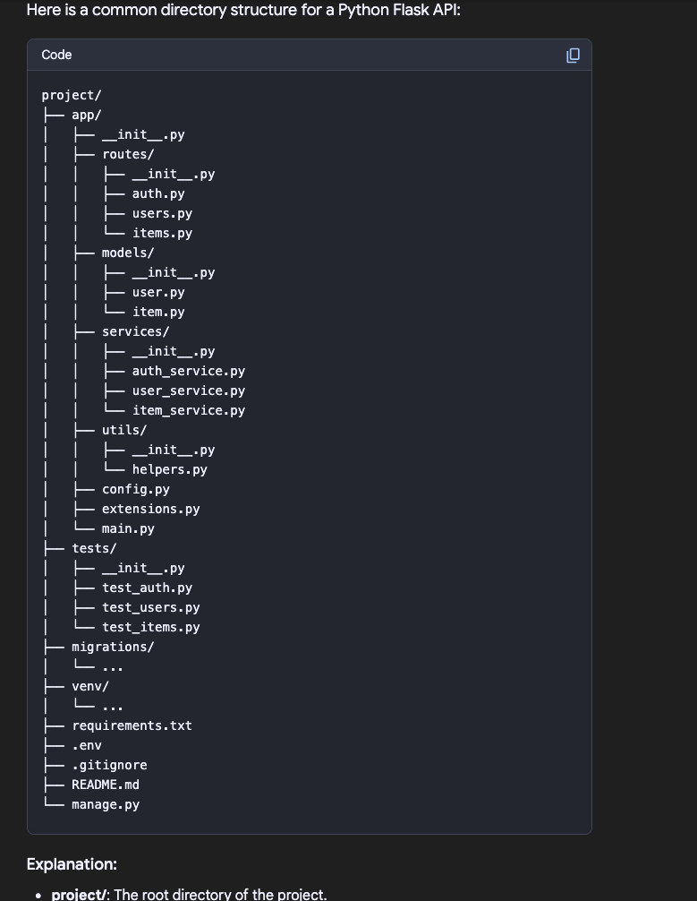
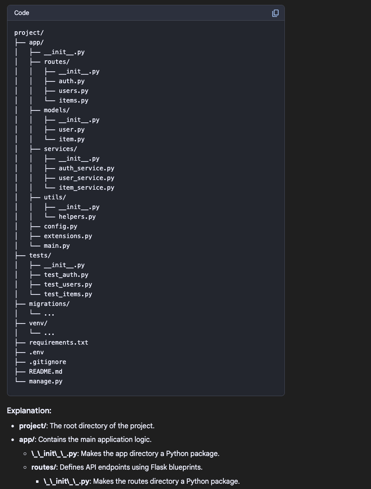

POSTGRES Usage
Configuration files:
installed on Mac ARM architecture using brew
all files are located in /opt/homebrew/var/postgres/
used jsonb to store data transferred from ivolunteer

**Explanation:**

    json_populate_recordset(NULL::your_table, %s): This function takes two arguments:
        NULL::your_table: This specifies the table structure that the JSON objects should be mapped to.
        %s: This is a placeholder for the JSON data, which will be passed from Python. 
    INSERT INTO your_table (data): This specifies the table and column where the data will be inserted.
    json.dumps(data): This converts the Python list of dictionaries into a JSON string.
    cur.execute(insert_sql, (json.dumps(data),)): This executes the SQL query with the JSON data as a parameter.
    conn.commit(): This commits the changes to the database. 
---
jsonb data type: The data column in the table should be of the jsonb data type. 
jsonb is the preferred data type for JSON storage in PostgreSQL because it offers better performance 
and indexing capabilities compared to the json data type.

Error handling: You should add error handling to your code to gracefully handle potential issues 
like database connection errors or invalid JSON data.

ß
